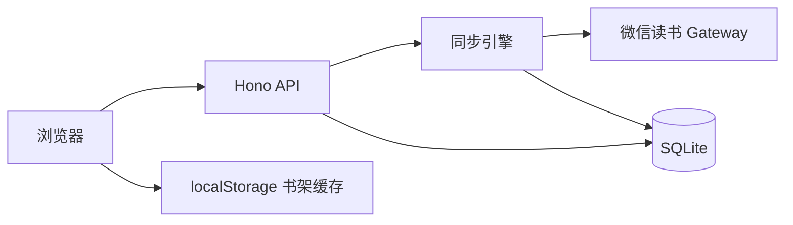

<div align="center">

# 阅读生活

**把微信读书的书架、划线和进度，留在自己的电脑上慢慢看。**

[](https://github.com/lurui1997/read-life/stargazers)
[](https://github.com/lurui1997/read-life/network/members)
[](https://nodejs.org/)
[](https://www.typescriptlang.org/)

[快速开始](#-快速开始) · [功能亮点](#-功能亮点) · [惊喜模式](#-惊喜模式) · [架构](#-架构) · [开发](#-开发)

</div>

---

## 这是什么

**阅读生活**是一个**本机优先**的微信读书同步站：

- 粘贴 API Key → 同步书架、进度、划线
- 在浏览器里按自己的节奏浏览、回看、邂逅好书
- 数据落在本机 SQLite，Key 不出你的电脑

适合书架 **上千本**、想拥有**私人阅读档案**的读者。

---

## 目录

- [界面预览](#-界面预览)
- [为什么选择](#-为什么选择)
- [功能亮点](#-功能亮点)
- [惊喜模式](#-惊喜模式)
- [快速开始](#-快速开始)
- [使用提示](#-使用提示)
- [架构](#-架构)
- [技术栈](#-技术栈)
- [开发](#-开发)
- [路线图](#-路线图)
- [参与贡献](#-参与贡献)
- [FAQ](#-faq)

---

## 界面预览

打开书架后，内置**功能导览**会轮播介绍主要页面（可关闭，随时从「功能导览」重新打开）：

| 页面 | 做什么 |
| --- | --- |
| **书架** | 大数字概览 + 五种浏览方式，分组默认折叠 |
| **分组 / 分类** | 左侧导航、右侧书 grid，无限滚动 |
| **书页** | 按章节展示全部划线，窄栏心流排版 |
| **惊喜模式** | 随机打乱书序，「换一个顺序」重新洗牌 |

> 提示：首次访问可在导览最后一页点击「试试惊喜模式」一键体验。

---

## 为什么选择

| | 阅读生活 | 只在微信读书 App |
| --- | --- | --- |
| 数据归属 | 本机 SQLite | 平台内 |
| 浏览视角 | 分组 / 进度 / 分类 / 推荐值 / 随机 | 单一列表 |
| 大书架 | 折叠 + 无限滚动 + 惊喜模式 | 长尾书难翻到 |
| 划线回看 | 按章节聚合，阅读栏宽优化 | 分散在 App 内 |
| 隐私 | Key 与数据不出本机 | — |

---

## 功能亮点

### 同步

- 同步在架书籍、阅读进度、划线（含章节结构）
- 已读完正确识别（`finishReading`），不再卡在 99%
- 单本失败不拖垮整架；失败项下次自动重试
- 后台补拉分类、推荐值；启动时刷新书架分组

### 书架

- **分组** — 同步微信读书分组，左右分栏
- **进度** — 在读 / 未读 / 已读完
- **推荐值** — 神作、好评如潮等档位
- **分类** — 大类 + 子类筛选
- **随机** — 按进度分组 + 惊喜模式
- **无限滚动** — 接近底部自动加载
- **本地缓存** — 打开先显示缓存，同步后刷新

### 书页

- 划线按章节静静呈现
- 返回书架 · 跳转微信读书继续读

### 设计

- Apple 风格简约界面，宁静心流阅读体验
- 尊重 `prefers-reduced-motion`

---

## 惊喜模式

书架太深时，排序靠后的书可能永远不会被翻到。**惊喜模式**为此而生：

1. 打开书架顶部的 **惊喜模式** 开关
2. 每个分组内的书序会**随机排列**
3. 点击 **换一个顺序** 重新洗牌
4. 在「随机」浏览方式下会自动启用

适合：未读 4000+、想随缘重遇一本老书。

---

## 快速开始

### 环境

- **Node.js 20+**
- macOS / Linux（Windows 未专门测试）

### 三步跑起来

```bash
git clone https://github.com/lurui1997/read-life.git
cd read-life
npm install && npm start
```

浏览器打开 **http://127.0.0.1:8787**

```bash
# 指定端口
PORT=8788 npm start

# 开发模式（热更新）
npm run dev
```

### 配置 Key

1. 打开 **设置**
2. 粘贴微信读书 **API Key** 并保存
3. 回到书架，点击 **同步**

Key 写入 `data/read-life.sqlite`，不上传任何第三方。

> API Key 需来自你已有的微信读书 Agent / 开放平台能力。本项目通过 `POST https://i.weread.qq.com/api/agent/gateway` 调用官方接口。

---

## 使用提示

| 场景 | 建议 |
| --- | --- |
| 第一次同步 | 书多时需等待；顶栏显示进度 |
| 书太多翻不到 | 开惊喜模式，或切到「随机」 |
| 读划线 | 点书卡进入书页 |
| 全量刷新 | 顶栏「强制同步」 |
| 重温功能 | 标题下点「功能导览」 |

---

## 架构



```
read-life/
├── src/server/    # API、同步、数据库
├── src/web/       # React 书架 · 书页 · 导览
├── src/shared/    # 类型与共享逻辑
├── test/          # Vitest
└── data/          # SQLite（gitignore）
```

---

## 技术栈

| 层级 | 选型 |
| --- | --- |
| 运行时 | Node.js + TypeScript |
| 服务端 | [Hono](https://hono.dev/) |
| 数据库 | [better-sqlite3](https://github.com/WiseLibs/better-sqlite3) |
| 前端 | React 19 + Vite |
| 测试 | Vitest |

---

## 开发

```bash
npm test              # 测试
npx tsc --noEmit      # 类型检查
npm run build         # 构建前端
```

| 环境变量 | 默认 | 说明 |
| --- | --- | --- |
| `PORT` | `8787` | 监听端口 |
| `READ_LIFE_DB` | `data/read-life.sqlite` | 数据库路径 |
| `NODE_ENV` | — | `production` 时服务静态资源 |

---

## 路线图

- [ ] 导出划线（Markdown / CSV）
- [ ] 搜索书名与划线全文
- [ ] 阅读统计

**刻意不做**：多用户、Cookie 登录、有声书、书评、云端托管。

---

## 参与贡献

Issue 和 Pull Request 都欢迎。

1. Fork 本仓库
2. 创建分支：`git checkout -b feat/your-feature`
3. 提交改动并推送到分支
4. 发起 Pull Request

如果这个项目对你有帮助，欢迎 **Star** 支持，也欢迎 **Fork** 按自己的习惯改造。

[](https://star-history.com/#lurui1997/read-life&Date)

---

## FAQ

**Q：数据存在哪里？**  
A：本机 `data/read-life.sqlite`，可备份此文件迁移。

**Q：Key 安全吗？**  
A：Key 只存在本机 SQLite，页面不会把它发到除微信读书 gateway 以外的服务。

**Q：同步很慢？**  
A：书架越大越久；单本失败不影响其他书，下次同步会重试。

**Q：惊喜模式和「随机」有什么区别？**  
A：「随机」是浏览方式，默认开惊喜模式；其他视图也可单独打开惊喜模式开关。

**Q：为什么已读完显示 99%？**  
A：已修复：同步 `finishReading` 后归一化为 100% /「已读完」。

---

## 致谢

灵感来自「**阅读数据应该属于读者自己**」—— 微信读书负责读，阅读生活负责把痕迹留在本机。

---

<p align="center">
  <sub>Made with calm · 按自己的节奏浏览，不必一次看完。</sub>
</p>

<p align="center">
  <a href="https://github.com/lurui1997/read-life/stargazers">⭐ Star</a>
  ·
  <a href="https://github.com/lurui1997/read-life/fork">🍴 Fork</a>
  ·
  <a href="https://github.com/lurui1997/read-life/issues">💬 Issue</a>
</p>
